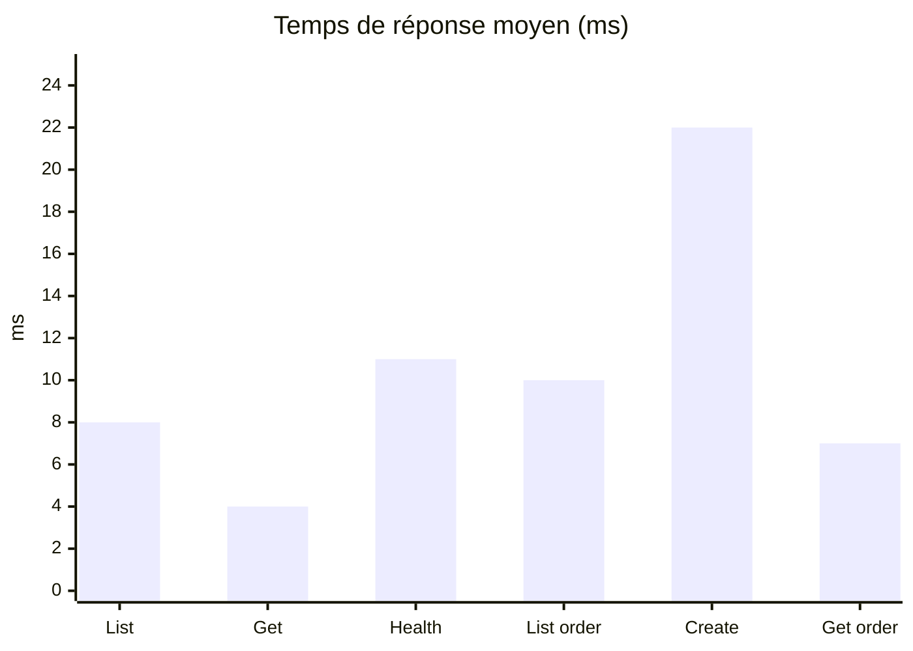
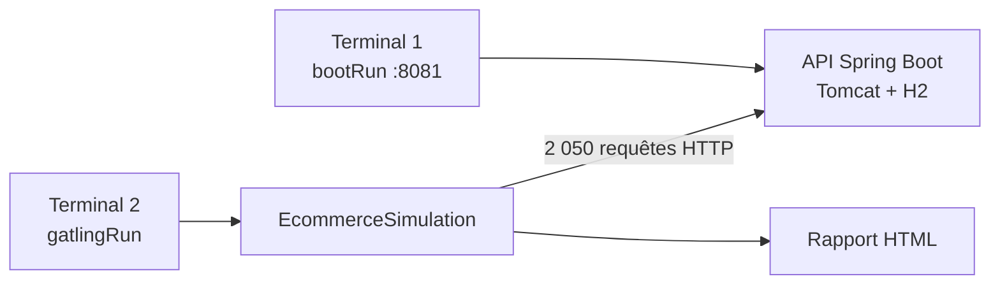

<div align="center">

# 🛒 E-Commerce API — Rapport de Performance

**API REST Spring Boot · Tests de charge Gatling 3.15**

<br/>

[](https://spring.io/projects/spring-boot)
[](https://openjdk.org/)
[](https://gatling.io/)
[](https://gradle.org/)

<br/>

**Mouhamad Moustapha Ndoye** · **Ndeye Madeleine Diallo**  
*Encadré par Keba Deme — 25 mai 2026*

</div>

---

## 📋 Sommaire

| | Section |
|:--|:--------|
| ⚡ | [Démarrage rapide](#-démarrage-rapide) |
| 📊 | [Verdict & résultats](#-verdict--résultats) |
| 🔧 | [Qu'est-ce que Gatling ?](#-quest-ce-que-gatling-) |
| 🏗️ | [Architecture](#️-architecture-du-projet) |
| ⚙️ | [Configuration](#️-configuration-spring-boot--gatling) |
| 🚀 | [Exécution pas à pas](#-exécution-pas-à-pas) |
| 📈 | [Analyse](#-analyse) |
| 💻 | [Commandes utiles](#-commandes-utiles) |

---

## ⚡ Démarrage rapide

> **Prérequis :** Java 17 · 2 terminaux PowerShell · port **8081** libre

| Étape | Terminal | Commande |
|:-----:|:---------|:---------|
| **1** | — | `java -version` |
| **2** | Terminal 1 | `.\gradlew.bat bootRun` *(laisser ouvert)* |
| **3** | Terminal 2 | `.\gradlew.bat :performance-tests:gatlingRun` |
| **4** | Terminal 2 | Ouvrir le rapport HTML *(voir ci-dessous)* |

```powershell
# Ouvrir le dernier rapport Gatling
$report = Get-ChildItem performance-tests\build\reports\gatling\ -Directory |
          Sort-Object Name -Descending | Select-Object -First 1
start "$($report.FullName)\index.html"
```

<details>
<summary><strong>Première exécution ?</strong> Compiler Gatling avant de lancer le test</summary>

```powershell
.\gradlew.bat :performance-tests:compileGatlingJava
```

</details>

---

## 📊 Verdict & résultats

<div align="center">

### ✅ Test concluant

| Requêtes | Succès | Moyenne | P95 | Débit |
|:--------:|:------:|:-------:|:---:|:-----:|
| **2 050** | **100 %** | **17 ms** | **10 ms** | **34 req/s** |

*Simulation `EcommerceSimulation` — run `ecommercesimulation-20260603201436007` · vérifié le 3 juin 2026*

</div>

### Détail par endpoint

| Requête | Total | Moyenne | P95 | Max |
|:--------|:-----:|:-------:|:---:|:---:|
| List products | 500 | 8 ms | 16 ms | 137 ms |
| Get product by id | 500 | **4 ms** | 9 ms | 79 ms |
| Health check products | 450 | 11 ms | 24 ms | 135 ms |
| List products for order | 200 | 10 ms | 20 ms | 168 ms |
| Create order | 200 | 22 ms | 27 ms | 574 ms |
| Get order | 200 | 7 ms | 16 ms | 65 ms |



<p align="center">

<br/><em>Rapport HTML Gatling — run <code>ecommercesimulation-20260603201436007</code></em>
</p>

---

## 🔧 Qu'est-ce que Gatling ?

**Gatling** est un outil open source de **test de charge et de performance** pour applications web et API REST. Il simule des centaines ou milliers d'utilisateurs virtuels qui envoient des requêtes HTTP en parallèle.

| Métrique | Description |
|:---------|:------------|
| **Temps de réponse** | Latence min, moyenne, max, percentiles (P50, P95, P99) |
| **Débit** | Nombre de requêtes par seconde (req/s) |
| **Taux de succès** | Pourcentage de requêtes HTTP 2xx vs erreurs |
| **Stabilité** | Comportement de l'API sous charge progressive ou soutenue |

### Gatling vs JUnit

| | JUnit | Gatling |
|:--|:------|:--------|
| **Objectif** | Correction fonctionnelle | Performance sous charge |
| **Charge** | 1 requête à la fois | Centaines d'utilisateurs simultanés |
| **Rapport** | Pass / Fail | Graphiques HTML, percentiles, débit |
| **Commande** | `.\gradlew.bat test` | `.\gradlew.bat :performance-tests:gatlingRun` |

### Concepts clés

| Concept | Rôle |
|:--------|:-----|
| **Simulation** | Classe Java décrivant scénarios, charge et assertions |
| **Scénario** | Enchaînement d'actions (GET produits → POST commande…) |
| **Injection** | Profil de charge (`rampUsers`, `constantUsersPerSec`…) |
| **Assertion** | Seuil de validation (ex. P95 < 5000 ms, succès > 90 %) |
| **Rapport HTML** | Généré dans `performance-tests/build/reports/gatling/` |

> 📚 Documentation officielle : [docs.gatling.io](https://docs.gatling.io/)

---

## 🏗️ Architecture du projet

Projet **Gradle multi-modules** : l'API Spring Boot et Gatling sont volontairement **séparés**.

```
e-commerce-api/
├── build.gradle.kts                      # Spring Boot 3.4.5 + JaCoCo
├── settings.gradle.kts                   # include("performance-tests")
├── src/main/java/com/ecommerce/api/      # Contrôleurs REST, services, JPA
├── src/main/resources/application.properties
└── performance-tests/                    # Module Gatling (isolé)
    ├── build.gradle.kts                  # Plugin io.gatling.gradle
    └── src/gatling/
        ├── java/simulations/EcommerceSimulation.java
        └── resources/gatling.conf
```

> **Pourquoi un module séparé ?**  
> Spring Boot embarque Tomcat et Netty. Gatling utilise sa propre version de Netty. Les fusionner provoque des conflits de classpath (`NoClassDefFoundError: IoHandle`). Le sous-module `performance-tests/` isole Gatling de l'API.

### Schéma d'exécution



| Terminal | Commande | Rôle |
|:---------|:---------|:-----|
| **1** | `.\gradlew.bat bootRun` | Démarre l'API sur le port 8081 |
| **2** | `.\gradlew.bat :performance-tests:gatlingRun` | Lance la simulation |

---

## ⚙️ Configuration Spring Boot + Gatling

<details>
<summary><strong>1.</strong> Enregistrer le module Gatling — <code>settings.gradle.kts</code></summary>

```kotlin
rootProject.name = "e-commerce-api"
include("performance-tests")
```

</details>

<details>
<summary><strong>2.</strong> API Spring Boot — <code>build.gradle.kts</code> (racine)</summary>

Le module racine ne contient **pas** Gatling :

```kotlin
plugins {
    java
    id("org.springframework.boot") version "3.4.5"
    id("io.spring.dependency-management") version "1.1.7"
    jacoco
}

dependencies {
    implementation("org.springframework.boot:spring-boot-starter-web")
    implementation("org.springframework.boot:spring-boot-starter-data-jpa")
    runtimeOnly("com.h2database:h2")
    // ...
}
```

| Commande | Rôle |
|:---------|:-----|
| `.\gradlew.bat bootRun` | Démarre l'API |
| `.\gradlew.bat test` | 35 tests JUnit + rapport JaCoCo |
| `.\gradlew.bat check` | Tests + couverture minimale 85 % |

</details>

<details>
<summary><strong>3.</strong> Port et base de données — <code>application.properties</code></summary>

```properties
server.port=8081
spring.datasource.url=jdbc:h2:mem:ecommerce;DB_CLOSE_DELAY=-1;DB_CLOSE_ON_EXIT=FALSE
spring.jpa.hibernate.ddl-auto=create-drop
spring.h2.console.enabled=true
```

| URL | Adresse |
|:----|:--------|
| API produits | http://localhost:8081/api/products |
| Swagger UI | http://localhost:8081/swagger-ui.html |
| Console H2 | http://localhost:8081/h2-console |

Au démarrage, `DataInitializer` injecte **5 produits de démo** en base H2 in-memory.

</details>

<details>
<summary><strong>4.</strong> Plugin Gatling — <code>performance-tests/build.gradle.kts</code></summary>

Gatling **n'est pas installé manuellement** : le plugin Gradle le télécharge automatiquement.

```kotlin
plugins {
    java
    id("io.gatling.gradle") version "3.15.0.3"
}

gatling {
    jvmArgs = listOf(
        "-server", "-Xms1g", "-Xmx2g",
        "--add-opens=java.base/java.lang=ALL-UNNAMED",
        "--add-opens=java.base/java.lang.invoke=ALL-UNNAMED",
        "--add-opens=java.base/jdk.internal.misc=ALL-UNNAMED"
    )
    systemProperties = mapOf("baseUrl" to "http://localhost:8081")
}
```

| Paramètre | Rôle |
|:----------|:-----|
| `io.gatling.gradle` | Ajoute les tâches `gatlingRun`, `compileGatlingJava` |
| `--add-opens` (×3) | **Obligatoire** avec Java 17 |
| `-Xms1g / -Xmx2g` | Mémoire allouée au moteur Gatling |
| `baseUrl` | URL de l'API — **doit correspondre** au `server.port` |

**Priorité de `baseUrl` :** ligne de commande → `build.gradle.kts` → défaut `http://localhost:8081`

</details>

<details>
<summary><strong>5.</strong> Configuration Gatling — <code>gatling.conf</code></summary>

```hocon
gatling {
  core {
    outputDirectoryBaseName = "ecommerce-perf"
  }
  charting {
    indicators { lowerBound = 800; higherBound = 1200 }
  }
}
```

</details>

<details>
<summary><strong>6.</strong> Simulation — <code>EcommerceSimulation.java</code></summary>

| Scénario | Injection | Requêtes HTTP |
|:---------|:----------|:--------------|
| **Browse products** | 500 users / 60 s | `GET /api/products` → `GET /api/products/{id}` |
| **Create order flow** | 200 users / 45 s | `GET /api/products` → `POST /api/orders` → `GET /api/orders/{id}` |
| **Sustained peak traffic** | 15 req/s / 30 s | `GET /api/products` |

**Assertions :** succès > 90 % · P95 < 5000 ms

| Méthode | Endpoint | Testé |
|:--------|:---------|:-----:|
| `GET` | `/api/products` | ✅ |
| `GET` | `/api/products/{id}` | ✅ |
| `POST` | `/api/orders` | ✅ |
| `GET` | `/api/orders/{id}` | ✅ |
| `POST` | `/api/products` | ❌ |
| `POST` | `/api/orders/{id}/cancel` | ❌ |

</details>

<details>
<summary><strong>7.</strong> Tâches Gradle Gatling disponibles</summary>

```powershell
.\gradlew.bat :performance-tests:tasks --group=gatling
```

| Tâche | Rôle |
|:------|:-----|
| `:performance-tests:gatlingRun` | Compile et lance `EcommerceSimulation` |
| `:performance-tests:compileGatlingJava` | Compile uniquement la simulation |
| `:performance-tests:gatlingClasses` | Compile simulation + `gatling.conf` |

</details>

---

## 🚀 Exécution pas à pas

### Étape 1 — Vérifier Java 17

```powershell
java -version
```

<p align="center">

<br/><em>Figure 1 — Version OpenJDK 17 (Temurin)</em>
</p>

---

### Étape 2 — Compiler Gatling *(première fois)*

```powershell
.\gradlew.bat :performance-tests:compileGatlingJava
```

<p align="center">

<br/><em>Figure 2 — BUILD SUCCESSFUL après compilation</em>
</p>

---

### Étape 3 — Démarrer l'API *(Terminal 1)*

```powershell
.\gradlew.bat bootRun
```

**Logs attendus :**
```
:: Spring Boot ::                (v3.4.5)
Tomcat started on port 8081 (http)
Started EcommerceApplication
```

<p align="center">

<br/><em>Figure 3 — Tomcat started on port 8081</em>
</p>

---

### Étape 4 — Vérifier l'endpoint *(Terminal 2)*

```powershell
(Invoke-WebRequest -Uri "http://localhost:8081/api/products" -UseBasicParsing).Content
```

**Attendu :** HTTP 200 + JSON avec 5 produits.

<p align="center">

<br/><em>Figure 4 — HTTP 200 · JSON des 5 produits</em>
</p>

---

### Étape 5 — Lancer Gatling *(Terminal 2, ~2 min)*

```powershell
.\gradlew.bat :performance-tests:gatlingRun
```

**Sortie attendue :**
```
Simulation simulations.EcommerceSimulation started...
Simulation simulations.EcommerceSimulation completed in ~60 seconds
Global: percentage of successful events is greater than 90.0 : true
Global: 95th percentile of response time is less than 5000.0 : true
BUILD SUCCESSFUL
```

<p align="center">

<br/><em>Figure 5 — 2 050 requêtes · BUILD SUCCESSFUL · assertions OK</em>
</p>

---

### Étape 6 — Résumé terminal

```
Simulation simulations.EcommerceSimulation completed in 60 seconds
> request count                    | 2,050 | 2,050 | -
> mean response time (ms)          |    17 |    17 | -
> response time 95th percentile    |    10 |    10 | -
> mean throughput (rps)            | 33.61 | 33.61 | -
Global: percentage of successful events is greater than 90.0 : true (actual : 100.0)
Global: 95th percentile of response time is less than 5000.0 : true (actual : 10.0)
BUILD SUCCESSFUL
```

<p align="center">

<br/><em>Figure 6 — Tableau Global Information</em>
</p>

---

### Étape 7 — Ouvrir le rapport HTML

```powershell
start performance-tests\build\reports\gatling\ecommercesimulation-20260603201436007\index.html
```

<p align="center">

<br/><em>Figure 7 — Vue globale du rapport HTML Gatling</em>
</p>

---

### 🛠️ Dépannage rapide

| Problème | Cause | Solution |
|:---------|:------|:---------|
| `Port 8081 was already in use` | Port occupé | Changer `server.port` + `baseUrl` |
| `Simulation crashed` | API non démarrée | Lancer `bootRun` **avant** `gatlingRun` |
| Succès < 90 % | Stock épuisé (H2) | Redémarrer `bootRun` |
| `NoClassDefFoundError: IoHandle` | Gatling dans module racine | Garder Gatling dans `performance-tests/` |
| `IllegalAccessException` | Java 17 sans `--add-opens` | Vérifier `performance-tests/build.gradle.kts` |

---

## 📈 Analyse

| Critère | Observation |
|:--------|:------------|
| **Fiabilité** | 2 050 requêtes, 0 erreur — API stable sous charge |
| **Latence** | P95 = 10 ms, largement sous le seuil de 5000 ms |
| **Débit** | 34 req/s avec 700 users injectés + trafic soutenu |
| **Point faible** | Quelques `Create order` jusqu'à 1 149 ms (écriture H2 + stock) |
| **Point fort** | P50 = 4 ms — la majorité des requêtes sont quasi instantanées |

> **Conclusion :** l'API **e-commerce-api** répond de manière **fiable et performante** sous charge simulée type production en local.  
> *Recommandation : tests complémentaires avec PostgreSQL/MySQL en environnement cloud.*

---

## 💻 Commandes utiles

```powershell
# ── Setup (première fois) ──
java -version
.\gradlew.bat :performance-tests:compileGatlingJava

# ── Tests Spring Boot (35 tests, JaCoCo 85 %) ──
.\gradlew.bat check

# ── Test de performance ──
# Terminal 1 — API
.\gradlew.bat bootRun

# Terminal 2 — Vérification + Gatling
Invoke-WebRequest -Uri "http://localhost:8081/api/products" -UseBasicParsing
.\gradlew.bat :performance-tests:gatlingRun

# Rapport HTML (dernier run)
$report = Get-ChildItem performance-tests\build\reports\gatling\ -Directory |
          Sort-Object Name -Descending | Select-Object -First 1
start "$($report.FullName)\index.html"
```

---

<div align="center">

<br/>

**Mouhamad Moustapha Ndoye** · **Ndeye Madeleine Diallo** · *Keba Deme*

[Simulation Gatling](performance-tests/src/gatling/java/simulations/EcommerceSimulation.java) ·
[Captures d'écran](docs/screenshots/) ·
[Documentation Gatling](https://docs.gatling.io/)

<br/>

*Projet e-commerce-api — Université*

</div>
