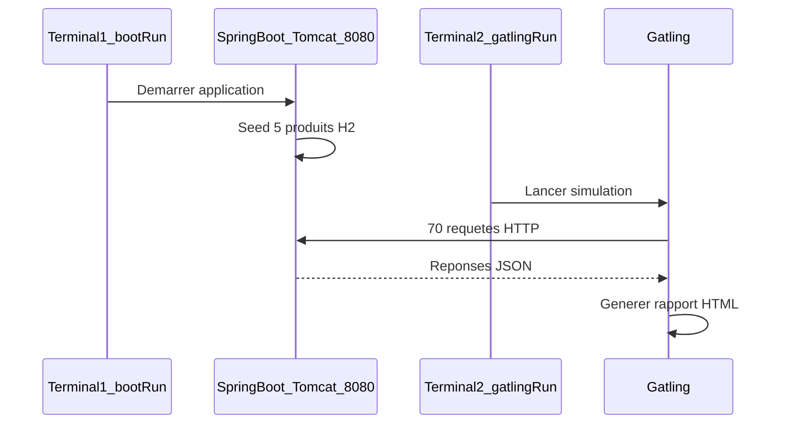

# Rapport — Test de performance avec Gatling

**Projet :** API REST E-Commerce (`e-commerce-api`)  
**Étudiants :** Mouhamad Moustapha Ndoye | Ndeye Madeleine Diallo  
**Date :** 24 mai 2026  
**Enseignant :** Keba Deme

---

## Résumé exécutif

Ce rapport documente la réalisation d'un **test de charge** sur l'API REST e-commerce développée avec **Spring Boot 3.4.5** et **Gradle**, à l'aide de l'outil **Gatling 3.15**. La simulation `EcommerceSimulation` a généré **70 requêtes HTTP** avec un taux de succès de **100 %**, un temps de réponse moyen de **13 ms** et un **P95 de 26 ms**. Les deux assertions configurées (succès > 90 %, P95 < 2000 ms) sont **validées**.

---

## Table des matières

1. [Introduction](#1-introduction)
2. [Contexte technique](#2-contexte-technique)
3. [Architecture du projet](#3-architecture-du-projet)
4. [Méthodologie](#4-méthodologie)
5. [Étapes réalisées](#5-étapes-réalisées)
6. [Configuration](#6-configuration)
7. [Résultats](#7-résultats)
8. [Analyse](#8-analyse)
9. [Conclusion](#9-conclusion)
10. [Annexes](#10-annexes)

---

## 1. Introduction

### 1.1 Objectif

Évaluer la **performance** de l'API e-commerce sous charge simulée : mesurer les temps de réponse, le débit (requêtes/seconde) et le taux d'erreur lorsque plusieurs utilisateurs virtuels accèdent simultanément aux endpoints REST.

### 1.2 Périmètre

| Inclus | Exclus |
|--------|--------|
| Endpoints produits et commandes | Authentification / sécurité |
| Charge légère (30 users max) | Test de stress extrême |
| Environnement local (H2 in-memory) | Déploiement cloud |

---

## 2. Contexte technique

| Composant | Version / détail |
|-----------|------------------|
| Langage | Java 17 |
| Framework | Spring Boot 3.4.5 |
| Build | Gradle 9.3.0 (wrapper) |
| Base de données | H2 in-memory (`jdbc:h2:mem:ecommerce`) |
| Outil de perf | Gatling 3.15.0.3 (plugin Gradle) |
| Port API | 8080 |
| Simulation | `EcommerceSimulation.java` |

L'application expose une API REST documentée via **Swagger UI** (`/swagger-ui.html`) et persiste les données en **H2** avec 5 produits injectés au démarrage.

---

## 3. Architecture du projet

Le projet Gradle est **multi-modules** : l'API Spring Boot et Gatling sont séparés pour éviter les conflits de dépendances (Netty).

```
e-commerce-api/                    ← Module Spring Boot
├── build.gradle.kts
├── src/main/.../EcommerceApplication.java
└── performance-tests/             ← Module Gatling
    ├── build.gradle.kts
    └── src/gatling/java/simulations/EcommerceSimulation.java
```

### Flux d'exécution



---

## 4. Méthodologie

### 4.1 Scénarios simulés

| Scénario | Charge | Description |
|----------|--------|-------------|
| **Browse products** | 20 utilisateurs sur 10 s (montée progressive) | Liste des produits puis détail du produit id=1 |
| **Create order flow** | 10 utilisateurs simultanés | Liste → création commande → lecture commande |

### 4.2 Endpoints testés

| Requête Gatling | Méthode | Endpoint Spring Boot |
|-----------------|---------|----------------------|
| List products | GET | `/api/products` |
| Get product by id | GET | `/api/products/1` |
| List products for order | GET | `/api/products` |
| Create order | POST | `/api/orders` |
| Get order | GET | `/api/orders/{id}` |

**Corps JSON de la commande simulée :**
```json
{
  "customerEmail": "perf-user@example.com",
  "items": [{"productId": 1, "quantity": 1}]
}
```

### 4.3 Critères de succès (assertions Gatling)

| Assertion | Seuil | Résultat |
|-----------|-------|----------|
| Taux de succès global | > 90 % | **100 %** — OK |
| P95 temps de réponse | < 2000 ms | **26 ms** — OK |

---

## 5. Étapes réalisées

### Étape 1 — Vérification de Java 17

```powershell
java -version
```

**Commande exécutée à la racine du projet `e-commerce-api`.**


*Figure 1 — Version Java 17 requise par Spring Boot 3*

---

### Étape 2 — Installation / compilation Gatling

Gatling est intégré via le plugin Gradle dans le module `performance-tests` (pas d'installation manuelle).

```powershell
.\gradlew.bat :performance-tests:compileGatlingJava
```


*Figure 2 — Téléchargement des dépendances Gatling et compilation de la simulation*

---

### Étape 3 — Démarrage de l'API Spring Boot

**Terminal 1 :**

```powershell
.\gradlew.bat bootRun
```

Logs attendus :
```
Tomcat started on port 8080 (http)
Started EcommerceApplication
```


*Figure 3 — Application Spring Boot démarrée avec Tomcat sur le port 8080*

---

### Étape 4 — Vérification des endpoints REST

**Terminal 2 :**

```powershell
Invoke-WebRequest -Uri "http://localhost:8080/api/products" -UseBasicParsing
```

Résultat attendu : **HTTP 200** avec JSON contenant 5 produits (Laptop Pro, Wireless Mouse, etc.).


*Figure 4 — Réponse JSON de GET /api/products*

---

### Étape 5 — Exécution du test Gatling

**Terminal 2** (API toujours active) :

```powershell
.\gradlew.bat :performance-tests:gatlingRun
```

Durée de la simulation : **~9 secondes**.


*Figure 5 — Fin d'exécution avec BUILD SUCCESSFUL et assertions validées*

---

### Étape 6 — Consultation du rapport HTML

Rapport généré automatiquement par Gatling :

```
performance-tests/build/reports/gatling/ecommercesimulation-20260524210717587/index.html
```


*Figure 6 — Tableau Global Information affiché dans le terminal*

---

## 6. Configuration

### 6.1 Module Spring Boot — `build.gradle.kts`

```kotlin
plugins {
    java
    id("org.springframework.boot") version "3.4.5"
    id("io.spring.dependency-management") version "1.1.7"
    jacoco
}

dependencies {
    implementation("org.springframework.boot:spring-boot-starter-web")
    implementation("org.springframework.boot:spring-boot-starter-data-jpa")
    runtimeOnly("com.h2database:h2")
}
```


*Figure 7 — Fichier build.gradle.kts du module racine*

---

### 6.2 Module Gatling — `performance-tests/build.gradle.kts`

```kotlin
plugins {
    id("io.gatling.gradle") version "3.15.0.3"
}

gatling {
    systemProperties = mapOf("baseUrl" to "http://localhost:8080")
}
```


*Figure 8 — Plugin Gatling et URL de l'API (port 8080)*

---

### 6.3 Spring Boot — `application.properties`

```properties
server.port=8080
spring.datasource.url=jdbc:h2:mem:ecommerce
spring.jpa.hibernate.ddl-auto=create-drop
spring.h2.console.enabled=true
```


*Figure 9 — Port serveur et base H2 in-memory*

---

### 6.4 Simulation — `EcommerceSimulation.java`


*Figure 10 — Scénarios, injection de charge et assertions dans EcommerceSimulation.java*

---

## 7. Résultats

**Run de référence :** `ecommercesimulation-20260524210717587`  
**Date :** 24 mai 2026  
**Durée simulation :** 9 secondes

### 7.1 Résultats globaux

| Métrique | Valeur |
|----------|--------|
| **Requêtes totales** | 70 |
| **Succès (OK)** | 70 (100 %) |
| **Erreurs (KO)** | 0 (0 %) |
| **Temps min** | 4 ms |
| **Temps moyen** | 13 ms |
| **P50** | 10 ms |
| **P75** | 16 ms |
| **P95** | 26 ms |
| **P99** | 28 ms |
| **Temps max** | 28 ms |
| **Débit moyen** | 7 req/s |

### 7.2 Assertions

| Assertion | Statut |
|-----------|--------|
| Global: percentage of successful events > 90.0 | **OK** |
| Global: 95th percentile of response time < 2000.0 | **OK** |

### 7.3 Résultats par requête HTTP

| Requête | Total | OK | KO | Moyenne (ms) | P95 (ms) | Max (ms) |
|---------|-------|----|----|--------------|----------|----------|
| List products | 20 | 20 | 0 | 13 | 25 | 25 |
| Get product by id | 20 | 20 | 0 | 6 | 9 | 9 |
| List products for order | 10 | 10 | 0 | 26 | 28 | 28 |
| Create order | 10 | 10 | 0 | 16 | 21 | 21 |
| Get order | 10 | 10 | 0 | 8 | 10 | 10 |
| **Total** | **70** | **70** | **0** | **13** | **26** | **28** |

### 7.4 Captures du rapport Gatling HTML


*Figure 11 — Rapport HTML Gatling : statistiques globales et tableau des requêtes*


*Figure 12 — Graphique Response Time Percentiles (P50, P75, P95, P99)*


*Figure 13 — Détail par endpoint HTTP (List products, Create order, etc.)*

---

## 8. Analyse

### 8.1 Performance

- **100 % de requêtes réussies** : l'API Spring Boot a traité toute la charge sans erreur HTTP.
- **P95 = 26 ms** : 95 % des requêtes répondent en moins de 26 ms, largement sous le seuil de 2000 ms.
- **Débit de 7 req/s** : cohérent avec une charge de 30 utilisateurs virtuels sur ~10 s en environnement local.

### 8.2 Points d'attention

| Requête | Observation |
|---------|-------------|
| List products for order | Latence moyenne plus élevée (26 ms) — probablement due au contexte JVM/H2 après montée en charge |
| Create order | Opération la plus coûteuse (16 ms moy.) — logique métier + écriture H2 + décrémentation stock |
| Get product by id | La plus rapide (6 ms moy.) — simple lecture par clé |

### 8.3 Limites de l'étude

- Test réalisé en **local** (machine de développement, H2 in-memory).
- Charge **modérée** (30 users max) — ne représente pas un pic de production.
- Pas de test de montée en charge progressive au-delà de 20 users/scénario.
- L'API et Gatling doivent tourner sur le **même port** (`8080`) — une mauvaise configuration de `baseUrl` provoque des erreurs 404.

---

## 9. Conclusion

Le test de performance avec **Gatling** sur l'API **e-commerce-api** (Spring Boot + Gradle) est **concluant** :

- Les **70 requêtes** simulées ont toutes réussi (**0 erreur**).
- Les **assertions** configurées sont **respectées** (succès > 90 %, P95 < 2000 ms).
- Les temps de réponse sont **excellents** en local (P95 = 26 ms).
- L'architecture **multi-modules Gradle** (API + `performance-tests`) permet d'isoler Gatling du classpath Spring Boot.

L'API répond de manière fiable et performante sous la charge testée. Pour une mise en production, des tests complémentaires avec une base PostgreSQL/MySQL et une charge plus élevée seraient recommandés.

---

## 10. Annexes

### A. Commandes complètes

```powershell
# Compilation Gatling
.\gradlew.bat :performance-tests:compileGatlingJava

# Terminal 1 — API
.\gradlew.bat bootRun

# Terminal 2 — Test perf
Invoke-WebRequest -Uri "http://localhost:8080/api/products" -UseBasicParsing
.\gradlew.bat :performance-tests:gatlingRun

# Ouvrir le rapport
start performance-tests\build\reports\gatling\ecommercesimulation-20260524210717587\index.html
```

### B. Captures d'écran

Enregistrer les PNG dans `docs/screenshots/` :

| Fichier | Contenu |
|---------|---------|
| `01-java-version.png` | Sortie de `java -version` |
| `03-gatling-compile.png` | BUILD SUCCESSFUL après compileGatlingJava |
| `09-spring-boot-run.png` | Log Started EcommerceApplication |
| `10-api-response.png` | JSON /api/products |
| `11-gatling-run.png` | BUILD SUCCESSFUL après gatlingRun |
| `12-gatling-summary.png` | Tableau Global Information |
| `13-gatling-report-global.png` | Rapport HTML — Global |
| `14-gatling-report-percentiles.png` | Graphique percentiles |
| `15-gatling-report-details.png` | Détail des 5 requêtes |

### C. Références

- [Guide technique](docs/performance-test-guide.md)
- [Simulation Gatling](performance-tests/src/gatling/java/simulations/EcommerceSimulation.java)
- Documentation Gatling : https://docs.gatling.io/

---

*Rapport généré dans le cadre du projet e-commerce-api — Test de performance avec Gatling.*
