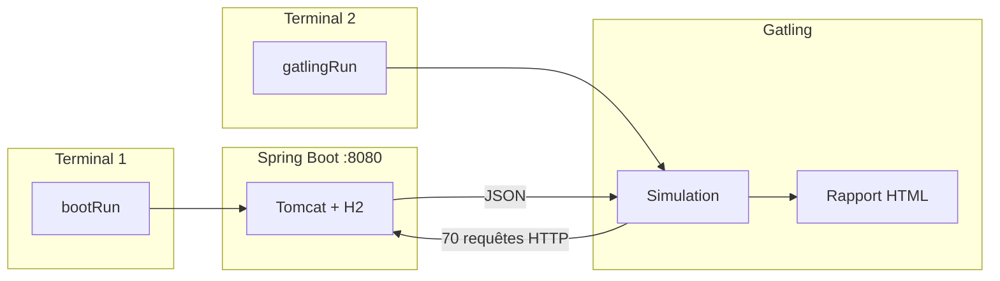
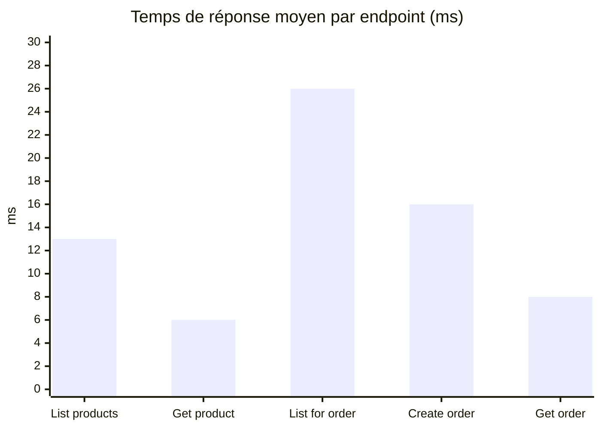

<div align="center">

# Rapport de Test de Performance

### API REST E-Commerce · Simulation Gatling

<br/>

[](https://spring.io/projects/spring-boot)
[](https://openjdk.org/)
[](https://gatling.io/)
[](https://gradle.org/)
[](https://www.h2database.com/)

<br/>

| | |
|:--|:--|
| **Projet** | `e-commerce-api` — API REST E-Commerce |
| **Étudiants** | Mouhamad Moustapha Ndoye · Ndeye Madeleine Diallo |
| **Enseignant** | Keba Deme |
| **Date** | 24 mai 2026 |

</div>

---

## Résumé exécutif

> **Verdict : test concluant.** La simulation `EcommerceSimulation` a généré **70 requêtes HTTP** avec un taux de succès de **100 %**, un temps de réponse moyen de **13 ms** et un **P95 de 26 ms**. Les deux assertions Gatling (succès > 90 %, P95 < 2000 ms) sont **validées**.

<table>
<tr>
<td align="center" width="20%">
<h3>70</h3>
<p>Requêtes</p>
</td>
<td align="center" width="20%">
<h3>100 %</h3>
<p>Succès</p>
</td>
<td align="center" width="20%">
<h3>13 ms</h3>
<p>Moyenne</p>
</td>
<td align="center" width="20%">
<h3>26 ms</h3>
<p>P95</p>
</td>
<td align="center" width="20%">
<h3>7 req/s</h3>
<p>Débit</p>
</td>
</tr>
</table>

---

## Table des matières

| # | Section | Description |
|:-:|---------|-------------|
| 1 | [Introduction](#1-introduction) | Objectifs et périmètre |
| 2 | [Contexte technique](#2-contexte-technique) | Stack et versions |
| 3 | [Architecture](#3-architecture-du-projet) | Structure multi-modules |
| 4 | [Méthodologie](#4-méthodologie) | Scénarios, endpoints, critères |
| 5 | [Étapes réalisées](#5-étapes-réalisées) | Procédure pas à pas |
| 6 | [Configuration](#6-configuration) | Fichiers clés |
| 7 | [Résultats](#7-résultats) | Métriques et captures |
| 8 | [Analyse](#8-analyse) | Interprétation |
| 9 | [Conclusion](#9-conclusion) | Synthèse |
| 10 | [Annexes](#10-annexes) | Commandes et références |

---

## 1. Introduction

### 1.1 Objectif

Évaluer la **performance** de l'API e-commerce sous charge simulée : mesurer les temps de réponse, le débit (requêtes/seconde) et le taux d'erreur lorsque plusieurs utilisateurs virtuels accèdent simultanément aux endpoints REST.

### 1.2 Périmètre

<table>
<tr>
<th width="50%" align="center">✅ Inclus</th>
<th width="50%" align="center">⛔ Exclus</th>
</tr>
<tr>
<td valign="top">
<ul>
<li>Endpoints produits et commandes</li>
<li>Charge légère (30 users max)</li>
<li>Environnement local (H2 in-memory)</li>
</ul>
</td>
<td valign="top">
<ul>
<li>Authentification / sécurité</li>
<li>Test de stress extrême</li>
<li>Déploiement cloud</li>
</ul>
</td>
</tr>
</table>

---

## 2. Contexte technique

<table>
<tr>
<th>Composant</th>
<th>Version / détail</th>
</tr>
<tr>
<td><strong>Langage</strong></td>
<td>Java 17</td>
</tr>
<tr>
<td><strong>Framework</strong></td>
<td>Spring Boot 3.4.5</td>
</tr>
<tr>
<td><strong>Build</strong></td>
<td>Gradle 9.3.0 (wrapper)</td>
</tr>
<tr>
<td><strong>Base de données</strong></td>
<td>H2 in-memory (<code>jdbc:h2:mem:ecommerce</code>)</td>
</tr>
<tr>
<td><strong>Outil de perf</strong></td>
<td>Gatling 3.15.0.3 (plugin Gradle)</td>
</tr>
<tr>
<td><strong>Port API</strong></td>
<td>8080</td>
</tr>
<tr>
<td><strong>Simulation</strong></td>
<td><code>EcommerceSimulation.java</code></td>
</tr>
</table>

L'application expose une API REST documentée via **Swagger UI** (`/swagger-ui.html`) et persiste les données en **H2** avec 5 produits injectés au démarrage.

---

## 3. Architecture du projet

Le projet Gradle est **multi-modules** : l'API Spring Boot et Gatling sont séparés pour éviter les conflits de dépendances (Netty).

```
e-commerce-api/                    ← Module Spring Boot
├── build.gradle.kts
├── src/main/.../EcommerceApplication.java
└── performance-tests/             ← Module Gatling
    ├── build.gradle.kts
    └── src/gatling/java/simulations/EcommerceSimulation.java
```

### Flux d'exécution



---

## 4. Méthodologie

### 4.1 Scénarios simulés

| Scénario | Charge | Description |
|:---------|:-------|:------------|
| **Browse products** | 20 utilisateurs / 10 s | Liste des produits → détail produit `id=1` |
| **Create order flow** | 10 utilisateurs simultanés | Liste → création commande → lecture commande |

### 4.2 Endpoints testés

| Requête Gatling | Méthode | Endpoint |
|:----------------|:-------:|:---------|
| List products | `GET` | `/api/products` |
| Get product by id | `GET` | `/api/products/1` |
| List products for order | `GET` | `/api/products` |
| Create order | `POST` | `/api/orders` |
| Get order | `GET` | `/api/orders/{id}` |

**Corps JSON de la commande simulée :**

```json
{
  "customerEmail": "perf-user@example.com",
  "items": [{ "productId": 1, "quantity": 1 }]
}
```

### 4.3 Critères de succès

| Assertion | Seuil | Résultat | Statut |
|:----------|:------|:---------|:------:|
| Taux de succès global | > 90 % | **100 %** | ✅ |
| P95 temps de réponse | < 2000 ms | **26 ms** | ✅ |

---

## 5. Étapes réalisées

<details open>
<summary><strong>Étape 1 — Vérification de Java 17</strong></summary>
<br/>

```powershell
java -version
```

**Commande exécutée à la racine du projet `e-commerce-api`.**


*Figure 1 — Version Java 17 requise par Spring Boot 3*

</details>

<details open>
<summary><strong>Étape 2 — Installation / compilation Gatling</strong></summary>
<br/>

Gatling est intégré via le plugin Gradle dans le module `performance-tests` (pas d'installation manuelle).

```powershell
.\gradlew.bat :performance-tests:compileGatlingJava
```


*Figure 2 — Téléchargement des dépendances Gatling et compilation de la simulation*

</details>

<details open>
<summary><strong>Étape 3 — Démarrage de l'API Spring Boot</strong></summary>
<br/>

**Terminal 1 :**

```powershell
.\gradlew.bat bootRun
```

Logs attendus :

```
Tomcat started on port 8080 (http)
Started EcommerceApplication
```


*Figure 3 — Application Spring Boot démarrée avec Tomcat sur le port 8080*

</details>

<details open>
<summary><strong>Étape 4 — Vérification des endpoints REST</strong></summary>
<br/>

**Terminal 2 :**

```powershell
Invoke-WebRequest -Uri "http://localhost:8080/api/products" -UseBasicParsing
```

Résultat attendu : **HTTP 200** avec JSON contenant 5 produits (Laptop Pro, Wireless Mouse, etc.).


*Figure 4 — Réponse JSON de GET /api/products*

</details>

<details open>
<summary><strong>Étape 5 — Exécution du test Gatling</strong></summary>
<br/>

**Terminal 2** (API toujours active) :

```powershell
.\gradlew.bat :performance-tests:gatlingRun
```

Durée de la simulation : **~9 secondes**.


*Figure 5 — Fin d'exécution avec BUILD SUCCESSFUL et assertions validées*

</details>

<details open>
<summary><strong>Étape 6 — Consultation du rapport HTML</strong></summary>
<br/>

Rapport généré automatiquement par Gatling :

```
performance-tests/build/reports/gatling/ecommercesimulation-20260524210717587/index.html
```


*Figure 6 — Tableau Global Information affiché dans le terminal*

</details>

---

## 6. Configuration

<table>
<tr>
<td width="50%" valign="top">

### 6.1 Spring Boot — `build.gradle.kts`

```kotlin
plugins {
    java
    id("org.springframework.boot") version "3.4.5"
    id("io.spring.dependency-management") version "1.1.7"
    jacoco
}

dependencies {
    implementation("org.springframework.boot:spring-boot-starter-web")
    implementation("org.springframework.boot:spring-boot-starter-data-jpa")
    runtimeOnly("com.h2database:h2")
}
```


*Figure 7 — Fichier build.gradle.kts du module racine*

</td>
<td width="50%" valign="top">

### 6.2 Gatling — `performance-tests/build.gradle.kts`

```kotlin
plugins {
    id("io.gatling.gradle") version "3.15.0.3"
}

gatling {
    systemProperties = mapOf("baseUrl" to "http://localhost:8080")
}
```


*Figure 8 — Plugin Gatling et URL de l'API (port 8080)*

</td>
</tr>
<tr>
<td width="50%" valign="top">

### 6.3 `application.properties`

```properties
server.port=8080
spring.datasource.url=jdbc:h2:mem:ecommerce
spring.jpa.hibernate.ddl-auto=create-drop
spring.h2.console.enabled=true
```


*Figure 9 — Port serveur et base H2 in-memory*

</td>
<td width="50%" valign="top">

### 6.4 Simulation — `EcommerceSimulation.java`


*Figure 10 — Scénarios, injection de charge et assertions*

</td>
</tr>
</table>

---

## 7. Résultats

> **Run de référence :** `ecommercesimulation-20260524210717587` · **Date :** 24 mai 2026 · **Durée :** 9 secondes

### 7.1 Résultats globaux

<table>
<tr>
<th>Métrique</th>
<th>Valeur</th>
<th>Visualisation</th>
</tr>
<tr>
<td><strong>Requêtes totales</strong></td>
<td align="center">70</td>
<td align="center">—</td>
</tr>
<tr>
<td><strong>Succès (OK)</strong></td>
<td align="center"><strong>70 (100 %)</strong></td>
<td align="center">████████████████████ 100 %</td>
</tr>
<tr>
<td><strong>Erreurs (KO)</strong></td>
<td align="center">0 (0 %)</td>
<td align="center">░░░░░░░░░░░░░░░░░░░░ 0 %</td>
</tr>
<tr>
<td><strong>Temps min</strong></td>
<td align="center">4 ms</td>
<td align="center">—</td>
</tr>
<tr>
<td><strong>Temps moyen</strong></td>
<td align="center"><strong>13 ms</strong></td>
<td align="center">█░░░░░░░░░░░░░░░░░░░ 0.7 % du seuil P95</td>
</tr>
<tr>
<td><strong>P50</strong></td>
<td align="center">10 ms</td>
<td align="center">—</td>
</tr>
<tr>
<td><strong>P75</strong></td>
<td align="center">16 ms</td>
<td align="center">—</td>
</tr>
<tr>
<td><strong>P95</strong></td>
<td align="center"><strong>26 ms</strong></td>
<td align="center">█░░░░░░░░░░░░░░░░░░░ 1.3 % du seuil 2000 ms</td>
</tr>
<tr>
<td><strong>P99</strong></td>
<td align="center">28 ms</td>
<td align="center">—</td>
</tr>
<tr>
<td><strong>Temps max</strong></td>
<td align="center">28 ms</td>
<td align="center">—</td>
</tr>
<tr>
<td><strong>Débit moyen</strong></td>
<td align="center">7 req/s</td>
<td align="center">—</td>
</tr>
</table>

### 7.2 Assertions

| Assertion | Statut |
|:----------|:------:|
| Global: percentage of successful events > 90.0 | ✅ **OK** |
| Global: 95th percentile of response time < 2000.0 | ✅ **OK** |

### 7.3 Résultats par requête HTTP

| Requête | Total | OK | KO | Moyenne | P95 | Max |
|:--------|:-----:|:--:|:--:|:-------:|:---:|:---:|
| List products | 20 | 20 | 0 | 13 ms | 25 ms | 25 ms |
| Get product by id | 20 | 20 | 0 | **6 ms** | 9 ms | 9 ms |
| List products for order | 10 | 10 | 0 | 26 ms | 28 ms | 28 ms |
| Create order | 10 | 10 | 0 | 16 ms | 21 ms | 21 ms |
| Get order | 10 | 10 | 0 | 8 ms | 10 ms | 10 ms |
| **Total** | **70** | **70** | **0** | **13 ms** | **26 ms** | **28 ms** |



### 7.4 Captures du rapport Gatling HTML

<table>
<tr>
<td align="center" width="33%">

<br/><em>Figure 11 — Vue globale</em>
</td>
<td align="center" width="33%">

<br/><em>Figure 12 — Percentiles P50–P99</em>
</td>
<td align="center" width="33%">

<br/><em>Figure 13 — Détail par endpoint</em>
</td>
</tr>
</table>

---

## 8. Analyse

### 8.1 Performance

<table>
<tr>
<th width="33%">Critère</th>
<th width="67%">Observation</th>
</tr>
<tr>
<td><strong>Fiabilité</strong></td>
<td>100 % de requêtes réussies — l'API traite toute la charge sans erreur HTTP.</td>
</tr>
<tr>
<td><strong>Latence</strong></td>
<td>P95 = 26 ms — 95 % des requêtes répondent en moins de 26 ms, largement sous le seuil de 2000 ms.</td>
</tr>
<tr>
<td><strong>Débit</strong></td>
<td>7 req/s — cohérent avec 30 utilisateurs virtuels sur ~10 s en environnement local.</td>
</tr>
</table>

### 8.2 Points d'attention

| Requête | Observation |
|:--------|:------------|
| **List products for order** | Latence moyenne plus élevée (26 ms) — contexte JVM/H2 après montée en charge |
| **Create order** | Opération la plus coûteuse (16 ms) — logique métier + écriture H2 + décrémentation stock |
| **Get product by id** | La plus rapide (6 ms) — simple lecture par clé |

### 8.3 Limites de l'étude

> ⚠️ **Environnement local** — machine de développement, H2 in-memory.  
> ⚠️ **Charge modérée** — 30 users max, ne représente pas un pic de production.  
> ⚠️ **Configuration réseau** — l'API et Gatling doivent partager le port `8080` ; une mauvaise `baseUrl` provoque des erreurs 404.

---

## 9. Conclusion

<table>
<tr>
<td>

### Bilan

Le test de performance avec **Gatling** sur l'API **e-commerce-api** (Spring Boot + Gradle) est **concluant** :

- **70 requêtes** simulées, **0 erreur**
- **Assertions respectées** (succès > 90 %, P95 < 2000 ms)
- **P95 = 26 ms** — performances excellentes en local
- Architecture **multi-modules Gradle** isolant Gatling du classpath Spring Boot

</td>
</tr>
</table>

> **Recommandation :** pour une mise en production, prévoir des tests complémentaires avec PostgreSQL/MySQL et une charge plus élevée.

---

## 10. Annexes

<details>
<summary><strong>A. Commandes complètes</strong></summary>
<br/>

```powershell
# Compilation Gatling
.\gradlew.bat :performance-tests:compileGatlingJava

# Terminal 1 — API
.\gradlew.bat bootRun

# Terminal 2 — Test perf
Invoke-WebRequest -Uri "http://localhost:8080/api/products" -UseBasicParsing
.\gradlew.bat :performance-tests:gatlingRun

# Ouvrir le rapport
start performance-tests\build\reports\gatling\ecommercesimulation-20260524210717587\index.html
```

</details>

<details>
<summary><strong>B. Captures d'écran</strong></summary>
<br/>

Enregistrer les PNG dans `docs/screenshots/` :

| Fichier | Contenu |
|:--------|:--------|
| `01-java-version.png` | Sortie de `java -version` |
| `03-gatling-compile.png` | BUILD SUCCESSFUL après compileGatlingJava |
| `09-spring-boot-run.png` | Log Started EcommerceApplication |
| `10-api-response.png` | JSON /api/products |
| `11-gatling-run.png` | BUILD SUCCESSFUL après gatlingRun |
| `12-gatling-summary.png` | Tableau Global Information |
| `13-gatling-report-global.png` | Rapport HTML — Global |
| `14-gatling-report-percentiles.png` | Graphique percentiles |
| `15-gatling-report-details.png` | Détail des 5 requêtes |

</details>

<details>
<summary><strong>C. Références</strong></summary>
<br/>

| Ressource | Lien |
|:----------|:-----|
| Guide technique | [docs/performance-test-guide.md](docs/performance-test-guide.md) |
| Simulation Gatling | [EcommerceSimulation.java](performance-tests/src/gatling/java/simulations/EcommerceSimulation.java) |
| Documentation Gatling | https://docs.gatling.io/ |
| Swagger UI (local) | http://localhost:8080/swagger-ui.html |

</details>

---

<div align="center">

<br/>

*Rapport généré dans le cadre du projet **e-commerce-api** — Test de performance avec Gatling.*

<br/>

**Mouhamad Moustapha Ndoye** · **Ndeye Madeleine Diallo** · *Keba Deme*

</div>
