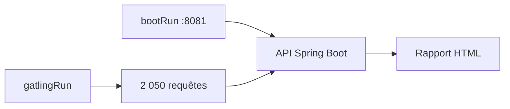
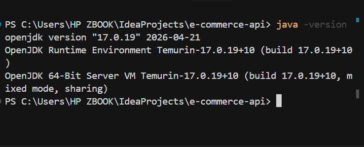
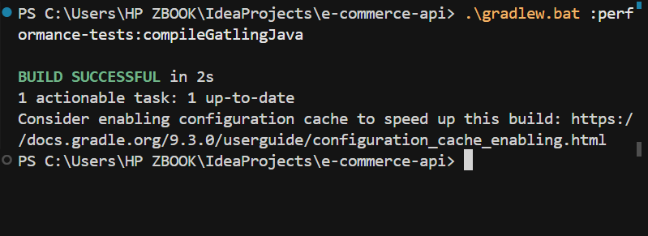
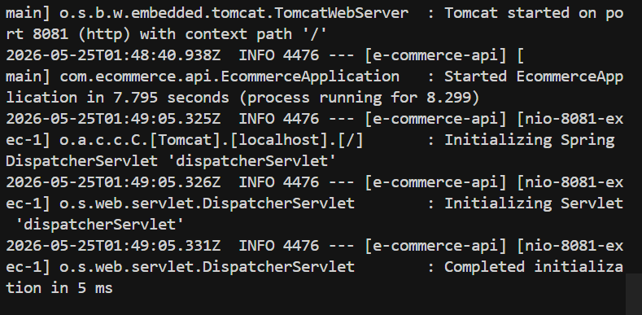
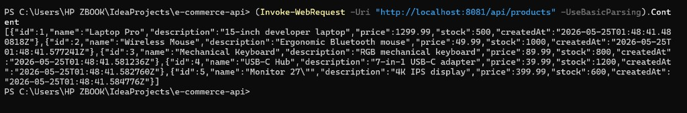
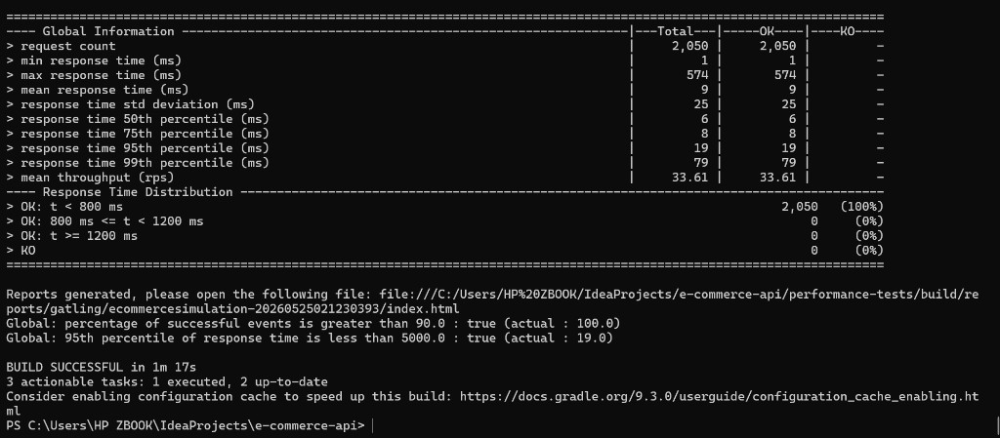
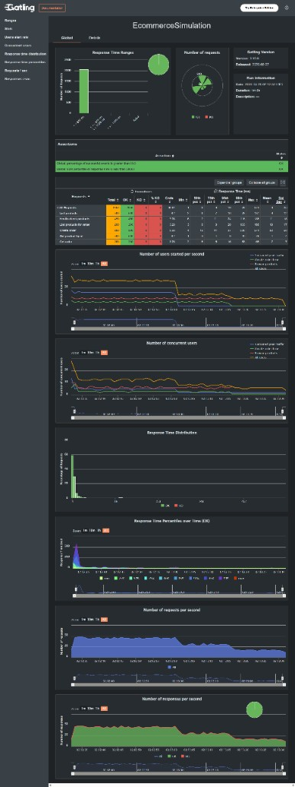
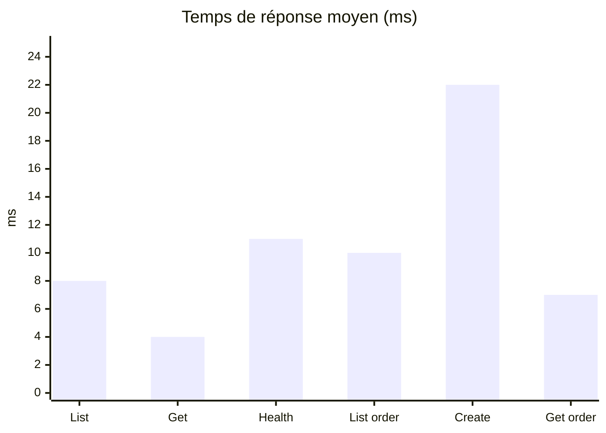

<div align="center">

# Rapport de Test de Performance

**API REST E-Commerce · Gatling 3.15 · Spring Boot 3.4.5**

<br/>

[](https://spring.io/projects/spring-boot)
[](https://openjdk.org/)
[](https://gatling.io/)
[](https://gradle.org/)

<br/>

**Mouhamad Moustapha Ndoye** · **Ndeye Madeleine Diallo**  
*Encadré par Keba Deme — 25 mai 2026*

<br/>

---

### Verdict : test concluant ✅

| **2 050** requêtes | **100 %** succès | **9 ms** moyenne | **19 ms** P95 | **34 req/s** |
|:---:|:---:|:---:|:---:|:---:|

*Simulation `EcommerceSimulation` — run `ecommercesimulation-20260525021230393`*

</div>

---

<p align="center">

[Introduction](#introduction) ·
[Méthodologie](#méthodologie) ·
[Étapes réalisées](#étapes-réalisées) ·
[Résultats](#résultats) ·
[Analyse](#analyse) ·
[Commandes](#commandes)

</p>

---

## Introduction

<div align="center">

Évaluation de la **performance** de l'API e-commerce sous **charge production simulée** :  
500 utilisateurs navigation · 200 utilisateurs commandes · 15 req/s soutenu.

| ✅ Inclus | ⛔ Exclus |
|:--|:--|
| Endpoints produits & commandes | Authentification |
| Charge élevée (2 050 requêtes) | Stress extrême |
| Environnement local H2 | Déploiement cloud |

</div>

**Stack :** Java 17 · Spring Boot 3.4.5 · Gradle · H2 in-memory · Gatling 3.15 · **Port 8081**

> Le port **8081** a été utilisé car le port 8080 était occupé. Gatling et l'API partagent le même port.

---

## Méthodologie

<div align="center">

| Scénario | Charge |
|:---------|:-------|
| Browse products | 500 users / 60 s |
| Create order flow | 200 users / 45 s |
| Sustained peak traffic | 15 req/s · 30 s |

| Assertion | Seuil | Résultat |
|:----------|:-----:|:--------:|
| Taux de succès | > 90 % | **100 %** ✅ |
| P95 | < 5000 ms | **19 ms** ✅ |

</div>



---

## Étapes réalisées

> Ordre : Terminal 1 pour l'API · Terminal 2 pour les tests · Port **8081**

---

### Étape 1 — Vérification de Java 17

```powershell
java -version
```

<p align="center">

<br/><em>Figure 1 — Version OpenJDK 17 (Temurin)</em>
</p>

---

### Étape 2 — Compilation Gatling

```powershell
.\gradlew.bat :performance-tests:compileGatlingJava
```

<p align="center">

<br/><em>Figure 2 — BUILD SUCCESSFUL après compilation de la simulation</em>
</p>

---

### Étape 3 — Démarrage de l'API Spring Boot

**Terminal 1** (laisser ouvert) :

```powershell
.\gradlew.bat bootRun --args="--server.port=8081"
```

<p align="center">

<br/><em>Figure 3 — Tomcat started on port 8081 · Started EcommerceApplication</em>
</p>

---

### Étape 4 — Vérification de l'endpoint REST

**Terminal 2** :

```powershell
(Invoke-WebRequest -Uri "http://localhost:8081/api/products" -UseBasicParsing).Content
```

<p align="center">

<br/><em>Figure 4 — HTTP 200 · JSON des 5 produits</em>
</p>

---

### Étape 5 — Exécution du test Gatling

**Terminal 2** (API toujours active, ~2 minutes) :

```powershell
.\gradlew.bat :performance-tests:gatlingRun -DbaseUrl=http://localhost:8081
```

<p align="center">

<br/><em>Figure 5 — 2 050 requêtes · BUILD SUCCESSFUL · assertions OK</em>
</p>

---

### Étape 6 — Résumé terminal (Global Information)

<p align="center">

<br/><em>Figure 6 — Tableau Global Information (requêtes, OK, percentiles)</em>
</p>

---

### Étape 7 — Rapport HTML Gatling

```powershell
start performance-tests\build\reports\gatling\ecommercesimulation-20260525021230393\index.html
```

<p align="center">

<br/><em>Figure 7 — Vue globale du rapport HTML Gatling</em>
</p>

---

## Résultats

<div align="center">

**Run :** `ecommercesimulation-20260525021230393` · **Durée :** 1 min 17 s · **Date :** 25 mai 2026

| Métrique | Valeur |
|:---------|:------:|
| Requêtes totales | **2 050** |
| Succès | **100 %** |
| Erreurs | **0** |
| Temps min / moy / max | 1 ms / **9 ms** / 574 ms |
| P50 / P75 / P95 / P99 | 6 / 8 / **19** / 79 ms |
| Débit | **34 req/s** |

</div>

### Par endpoint

| Requête | Total | Moyenne | P95 | Max |
|:--------|:-----:|:-------:|:---:|:---:|
| List products | 500 | 8 ms | 16 ms | 137 ms |
| Get product by id | 500 | **4 ms** | 9 ms | 79 ms |
| Health check products | 450 | 11 ms | 24 ms | 135 ms |
| List products for order | 200 | 10 ms | 20 ms | 168 ms |
| Create order | 200 | 22 ms | 27 ms | 574 ms |
| Get order | 200 | 7 ms | 16 ms | 65 ms |



---

## Analyse

<div align="center">

| Critère | Observation |
|:--------|:------------|
| **Fiabilité** | 2 050 requêtes, 0 erreur — API stable sous charge |
| **Latence** | P95 = 19 ms, largement sous le seuil de 5000 ms |
| **Débit** | 34 req/s avec 700 users injectés + trafic soutenu |
| **Point faible** | `Create order` — max 574 ms (écriture H2 + stock) |
| **Point fort** | `Get product by id` — 4 ms en moyenne |

<br/>

**Conclusion :** l'API **e-commerce-api** répond de manière **fiable et performante** sous charge simulée type production en local.

*Recommandation : tests complémentaires avec PostgreSQL/MySQL en environnement cloud.*

</div>

---

## Commandes

```powershell
# Terminal 1 — API
.\gradlew.bat bootRun --args="--server.port=8081"

# Terminal 2 — Test
Invoke-WebRequest -Uri "http://localhost:8081/api/products" -UseBasicParsing
.\gradlew.bat :performance-tests:gatlingRun -DbaseUrl=http://localhost:8081

# Rapport HTML
start performance-tests\build\reports\gatling\ecommercesimulation-20260525021230393\index.html
```

<p align="center">

[Guide technique](docs/performance-test-guide.md) ·
[Simulation Gatling](performance-tests/src/gatling/java/simulations/EcommerceSimulation.java) ·
[Documentation Gatling](https://docs.gatling.io/)

</p>

---

<div align="center">

<br/>

**Mouhamad Moustapha Ndoye** · **Ndeye Madeleine Diallo** · *Keba Deme*

*Projet e-commerce-api — Université*

</div>
