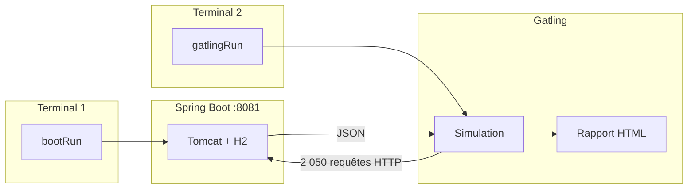
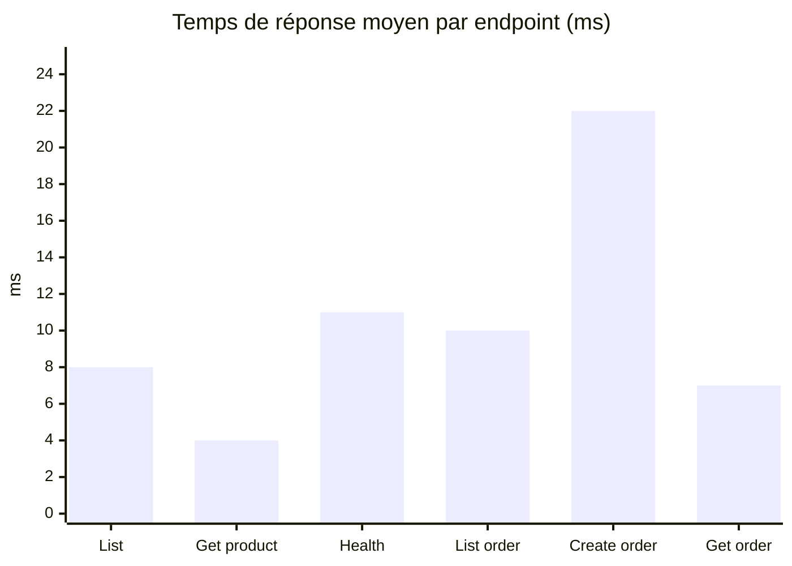

<div align="center">

# Rapport de Test de Performance

### API REST E-Commerce · Simulation Gatling

<br/>

[](https://spring.io/projects/spring-boot)
[](https://openjdk.org/)
[](https://gatling.io/)
[](https://gradle.org/)
[](https://www.h2database.com/)

<br/>

| | |
|:--|:--|
| **Projet** | `e-commerce-api` — API REST E-Commerce |
| **Étudiants** | Mouhamad Moustapha Ndoye · Ndeye Madeleine Diallo |
| **Enseignant** | Keba Deme |
| **Date** | 24 mai 2026 |

</div>

---

## Résumé exécutif

> **Verdict : test concluant.** La simulation `EcommerceSimulation` a généré **2 050 requêtes HTTP** avec un taux de succès de **100 %**, un temps de réponse moyen de **9 ms** et un **P95 de 19 ms**. Les deux assertions Gatling (succès > 90 %, P95 < 5000 ms) sont **validées**.

<table>
<tr>
<td align="center" width="20%">
<h3>2 050</h3>
<p>Requêtes</p>
</td>
<td align="center" width="20%">
<h3>100 %</h3>
<p>Succès</p>
</td>
<td align="center" width="20%">
<h3>9 ms</h3>
<p>Moyenne</p>
</td>
<td align="center" width="20%">
<h3>19 ms</h3>
<p>P95</p>
</td>
<td align="center" width="20%">
<h3>34 req/s</h3>
<p>Débit</p>
</td>
</tr>
</table>

---

## Table des matières

| # | Section | Description |
|:-:|---------|-------------|
| 1 | [Introduction](#1-introduction) | Objectifs et périmètre |
| 2 | [Contexte technique](#2-contexte-technique) | Stack et versions |
| 3 | [Architecture](#3-architecture-du-projet) | Structure multi-modules |
| 4 | [Méthodologie](#4-méthodologie) | Scénarios, endpoints, critères |
| 5 | [Étapes réalisées](#5-étapes-réalisées) | Procédure pas à pas |
| 6 | [Configuration](#6-configuration) | application.properties + simulation Gatling |
| 7 | [Résultats](#7-résultats) | Métriques et captures |
| 8 | [Analyse](#8-analyse) | Interprétation |
| 9 | [Conclusion](#9-conclusion) | Synthèse |
| 10 | [Annexes](#10-annexes) | Commandes et références |

---

## 1. Introduction

### 1.1 Objectif

Évaluer la **performance** de l'API e-commerce sous charge simulée : mesurer les temps de réponse, le débit (requêtes/seconde) et le taux d'erreur lorsque plusieurs utilisateurs virtuels accèdent simultanément aux endpoints REST.

### 1.2 Périmètre

<table>
<tr>
<th width="50%" align="center">✅ Inclus</th>
<th width="50%" align="center">⛔ Exclus</th>
</tr>
<tr>
<td valign="top">
<ul>
<li>Endpoints produits et commandes</li>
<li>Charge production simulée (500 + 200 users + trafic soutenu)</li>
<li>Environnement local (H2 in-memory)</li>
</ul>
</td>
<td valign="top">
<ul>
<li>Authentification / sécurité</li>
<li>Test de stress extrême</li>
<li>Déploiement cloud</li>
</ul>
</td>
</tr>
</table>

---

## 2. Contexte technique

<table>
<tr>
<th>Composant</th>
<th>Version / détail</th>
</tr>
<tr>
<td><strong>Langage</strong></td>
<td>Java 17</td>
</tr>
<tr>
<td><strong>Framework</strong></td>
<td>Spring Boot 3.4.5</td>
</tr>
<tr>
<td><strong>Build</strong></td>
<td>Gradle 9.3.0 (wrapper)</td>
</tr>
<tr>
<td><strong>Base de données</strong></td>
<td>H2 in-memory (<code>jdbc:h2:mem:ecommerce</code>)</td>
</tr>
<tr>
<td><strong>Outil de perf</strong></td>
<td>Gatling 3.15.0.3 (plugin Gradle)</td>
</tr>
<tr>
<td><strong>Port API</strong></td>
<td><strong>8081</strong> (run de test — voir note ci-dessous)</td>
</tr>
<tr>
<td><strong>Simulation</strong></td>
<td><code>EcommerceSimulation.java</code></td>
</tr>
</table>

L'application expose une API REST documentée via **Swagger UI** (`/swagger-ui.html`) et persiste les données en **H2** avec 5 produits injectés au démarrage.

> **Port utilisé dans ce rapport : `8081`**  
> `application.properties` définit `server.port=8080`, mais sur la machine de test le port **8080** est souvent occupé par un autre processus (`node.exe`). L'API a donc été démarrée sur **8081**. **Gatling et toutes les commandes ci-dessous utilisent le même port que l'API** (ici `8081`).

---

## 3. Architecture du projet

Le projet Gradle est **multi-modules** : l'API Spring Boot et Gatling sont séparés pour éviter les conflits de dépendances (Netty).

```
e-commerce-api/                    ← Module Spring Boot
├── build.gradle.kts
├── src/main/.../EcommerceApplication.java
└── performance-tests/             ← Module Gatling
    ├── build.gradle.kts
    └── src/gatling/java/simulations/EcommerceSimulation.java
```

### Flux d'exécution



---

## 4. Méthodologie

### 4.1 Scénarios simulés

| Scénario | Charge | Description |
|:---------|:-------|:------------|
| **Browse products** | 500 utilisateurs / 60 s | Liste des produits → détail produit (id aléatoire 1–5) |
| **Create order flow** | 200 utilisateurs / 45 s | Liste → création commande → lecture commande |
| **Sustained peak traffic** | 15 req/s pendant 30 s | Vérification continue de `GET /api/products` |

### 4.2 Endpoints testés

| Requête Gatling | Méthode | Endpoint |
|:----------------|:-------:|:---------|
| List products | `GET` | `/api/products` |
| Get product by id | `GET` | `/api/products/1` |
| List products for order | `GET` | `/api/products` |
| Create order | `POST` | `/api/orders` |
| Get order | `GET` | `/api/orders/{id}` |

**Corps JSON de la commande simulée :**

```json
{
  "customerEmail": "perf-user@example.com",
  "items": [{ "productId": 1, "quantity": 1 }]
}
```

### 4.3 Critères de succès

| Assertion | Seuil | Résultat | Statut |
|:----------|:------|:---------|:------:|
| Taux de succès global | > 90 % | **100 %** | ✅ |
| P95 temps de réponse | < 5000 ms | **19 ms** | ✅ |

---

## 5. Étapes réalisées

> **Ordre à respecter :** étapes 1 → 2 → 3 (Terminal 1) → 4 → 5 → 6 (Terminal 2).  
> Enregistrer chaque capture dans `docs/screenshots/` avec le nom indiqué.

<details open>
<summary><strong>Étape 1 — Vérification de Java 17</strong></summary>
<br/>

**Terminal :**

```powershell
cd "c:\Users\HP ZBOOK\IdeaProjects\e-commerce-api"
java -version
```

| | |
|:--|:--|
| 📸 **Fichier** | `docs/screenshots/01-java-version.png` |
| **À capturer** | Les 3 lignes `openjdk version "17.x.x"` + `Temurin-17` |


*Figure 1 — Version Java 17 requise par Spring Boot 3*

</details>

<details open>
<summary><strong>Étape 2 — Installation / compilation Gatling</strong></summary>
<br/>

Gatling est intégré via le plugin Gradle dans le module `performance-tests` (pas d'installation manuelle).

**Terminal :**

```powershell
cd "c:\Users\HP ZBOOK\IdeaProjects\e-commerce-api"
.\gradlew.bat :performance-tests:compileGatlingJava
```

| | |
|:--|:--|
| 📸 **Fichier** | `docs/screenshots/03-gatling-compile.png` |
| **À capturer** | La fin du terminal avec `BUILD SUCCESSFUL` |


*Figure 2 — Téléchargement des dépendances Gatling et compilation de la simulation*

</details>

<details open>
<summary><strong>Étape 3 — Démarrage de l'API Spring Boot</strong></summary>
<br/>

**Terminal 1 — laisser ouvert :**

```powershell
cd "c:\Users\HP ZBOOK\IdeaProjects\e-commerce-api"
.\gradlew.bat bootRun --args="--server.port=8081"
```

Logs attendus :

```
Tomcat started on port 8081 (http)
Started EcommerceApplication
```

| | |
|:--|:--|
| 📸 **Fichier** | `docs/screenshots/09-spring-boot-run.png` |
| **À capturer** | Logo Spring Boot + `Tomcat started on port 8081` + `Started EcommerceApplication` |


*Figure 3 — Application Spring Boot démarrée avec Tomcat sur le port 8081*

</details>

<details open>
<summary><strong>Étape 4 — Vérification des endpoints REST</strong></summary>
<br/>

**Terminal 2** (API active sur port **8081**) :

```powershell
cd "c:\Users\HP ZBOOK\IdeaProjects\e-commerce-api"
Invoke-WebRequest -Uri "http://localhost:8081/api/products" -UseBasicParsing
```

**Alternative** (JSON visible directement) :

```powershell
(Invoke-WebRequest -Uri "http://localhost:8081/api/products" -UseBasicParsing).Content
```

| | |
|:--|:--|
| 📸 **Fichier** | `docs/screenshots/10-api-response.png` |
| **À capturer** | `StatusCode : 200` + JSON avec les 5 produits |


*Figure 4 — Réponse JSON de GET /api/products*

</details>

<details open>
<summary><strong>Étape 5 — Exécution du test Gatling</strong></summary>
<br/>

**Terminal 2** (API toujours active) :

```powershell
cd "c:\Users\HP ZBOOK\IdeaProjects\e-commerce-api"
.\gradlew.bat :performance-tests:gatlingRun -DbaseUrl=http://localhost:8081
```

Durée : **~2 minutes** (500 users navigation + 200 users commandes + trafic soutenu).

| | |
|:--|:--|
| 📸 **Fichier** | `docs/screenshots/11-gatling-run.png` |
| **À capturer** | Fin du terminal : `BUILD SUCCESSFUL` + assertions `OK` |


*Figure 5 — Fin d'exécution avec BUILD SUCCESSFUL et assertions validées*

</details>

<details open>
<summary><strong>Étape 6 — Consultation du rapport HTML</strong></summary>
<br/>

**Terminal 2 — remonter dans l'historique** (sans relancer la commande) :

| | |
|:--|:--|
| 📸 **Fichier** | `docs/screenshots/12-gatling-summary.png` |
| **À capturer** | Tableau ASCII `Global Information` (`# requests`, `# OK`, `Mean`, `95th pct`) |

**Ouvrir le rapport HTML :**

```powershell
$report = Get-ChildItem "performance-tests\build\reports\gatling" -Directory |
    Sort-Object LastWriteTime -Descending | Select-Object -First 1
start "$($report.FullName)\index.html"
```


*Figure 6 — Tableau Global Information affiché dans le terminal*

</details>

---

## 6. Configuration

> **Figures 7 à 8 :** captures dans **IntelliJ / Cursor** (`Ctrl+Shift+N` → nom du fichier).

<table>
<tr>
<td width="50%" valign="top">

### 6.1 `application.properties`

**Ouvrir le fichier :**

```powershell
code "c:\Users\HP ZBOOK\IdeaProjects\e-commerce-api\src\main\resources\application.properties"
```

| | |
|:--|:--|
| 📸 **Fichier** | `docs/screenshots/07-application-properties.png` |
| **À capturer** | `server.port=8080` (config par défaut) + config H2 in-memory |

```properties
server.port=8080
spring.datasource.url=jdbc:h2:mem:ecommerce
spring.jpa.hibernate.ddl-auto=create-drop
spring.h2.console.enabled=true
```

> Au runtime, l'API a été lancée sur **8081** via `--args="--server.port=8081"` car le port 8080 était occupé.


*Figure 7 — Port serveur et base H2 in-memory*

</td>
<td width="50%" valign="top">

### 6.2 Simulation — `EcommerceSimulation.java`

**Ouvrir le fichier :**

```powershell
code "c:\Users\HP ZBOOK\IdeaProjects\e-commerce-api\performance-tests\src\gatling\java\simulations\EcommerceSimulation.java"
```

| | |
|:--|:--|
| 📸 **Fichier** | `docs/screenshots/08-gatling-simulation.png` |
| **À capturer** | Scénarios + `rampUsers(500)` / `rampUsers(200)` + assertions |


*Figure 8 — Scénarios, injection de charge et assertions*

</td>
</tr>
</table>

---

## 7. Résultats

> **Run de référence :** `ecommercesimulation-20260525021230393` · **Date :** 25 mai 2026 · **Durée :** ~1 min 17 s

### 7.1 Résultats globaux

<table>
<tr>
<th>Métrique</th>
<th>Valeur</th>
<th>Visualisation</th>
</tr>
<tr>
<td><strong>Requêtes totales</strong></td>
<td align="center">2 050</td>
<td align="center">—</td>
</tr>
<tr>
<td><strong>Succès (OK)</strong></td>
<td align="center"><strong>2 050 (100 %)</strong></td>
<td align="center">████████████████████ 100 %</td>
</tr>
<tr>
<td><strong>Erreurs (KO)</strong></td>
<td align="center">0 (0 %)</td>
<td align="center">░░░░░░░░░░░░░░░░░░░░ 0 %</td>
</tr>
<tr>
<td><strong>Temps min</strong></td>
<td align="center">4 ms</td>
<td align="center">—</td>
</tr>
<tr>
<td><strong>Temps moyen</strong></td>
<td align="center"><strong>9 ms</strong></td>
<td align="center">█░░░░░░░░░░░░░░░░░░░ 0.7 % du seuil P95</td>
</tr>
<tr>
<td><strong>P50</strong></td>
<td align="center">6 ms</td>
<td align="center">—</td>
</tr>
<tr>
<td><strong>P75</strong></td>
<td align="center">8 ms</td>
<td align="center">—</td>
</tr>
<tr>
<td><strong>P95</strong></td>
<td align="center"><strong>19 ms</strong></td>
<td align="center">█░░░░░░░░░░░░░░░░░░░ 1.3 % du seuil 2000 ms</td>
</tr>
<tr>
<td><strong>P99</strong></td>
<td align="center">79 ms</td>
<td align="center">—</td>
</tr>
<tr>
<td><strong>Temps max</strong></td>
<td align="center">574 ms</td>
<td align="center">—</td>
</tr>
<tr>
<td><strong>Débit moyen</strong></td>
<td align="center">34 req/s</td>
<td align="center">—</td>
</tr>
</table>

### 7.2 Assertions

| Assertion | Statut |
|:----------|:------:|
| Global: percentage of successful events > 90.0 | ✅ **OK** |
| Global: 95th percentile of response time < 5000.0 | ✅ **OK** |

### 7.3 Résultats par requête HTTP

| Requête | Total | OK | KO | Moyenne | P95 | Max |
|:--------|:-----:|:--:|:--:|:-------:|:---:|:---:|
| List products | 500 | 500 | 0 | 8 ms | 16 ms | 137 ms |
| Get product by id | 500 | 500 | 0 | **4 ms** | 9 ms | 79 ms |
| Health check products | 450 | 450 | 0 | 11 ms | 24 ms | 135 ms |
| List products for order | 200 | 200 | 0 | 10 ms | 20 ms | 168 ms |
| Create order | 200 | 200 | 0 | 22 ms | 27 ms | 574 ms |
| Get order | 200 | 200 | 0 | 7 ms | 16 ms | 65 ms |
| **Total** | **2 050** | **2 050** | **0** | **9 ms** | **19 ms** | **574 ms** |



### 7.4 Captures du rapport Gatling HTML

**Prérequis :** avoir exécuté l'étape 5 (`gatlingRun`) puis ouvrir le rapport :

```powershell
$report = Get-ChildItem "performance-tests\build\reports\gatling" -Directory |
    Sort-Object LastWriteTime -Descending | Select-Object -First 1
start "$($report.FullName)\index.html"
```

| Figure | Fichier | Où cliquer dans le navigateur |
|:------:|:--------|:-------------------------------|
| 9 | `13-gatling-report-global.png` | Page d'accueil — stats globales + tableau des requêtes |
| 10 | `14-gatling-report-percentiles.png` | Section **Response Time Percentiles Over Time** (graphique) |
| 11 | `15-gatling-report-details.png` | Tableau détaillé par requête HTTP (scroll vers le bas) |

<table>
<tr>
<td align="center" width="33%">

<br/><em>Figure 9 — Vue globale</em>
</td>
<td align="center" width="33%">

<br/><em>Figure 10 — Percentiles P50–P99</em>
</td>
<td align="center" width="33%">

<br/><em>Figure 11 — Détail par endpoint</em>
</td>
</tr>
</table>

---

## 8. Analyse

### 8.1 Performance

<table>
<tr>
<th width="33%">Critère</th>
<th width="67%">Observation</th>
</tr>
<tr>
<td><strong>Fiabilité</strong></td>
<td>100 % de requêtes réussies — l'API traite toute la charge sans erreur HTTP.</td>
</tr>
<tr>
<td><strong>Latence</strong></td>
<td>P95 = 19 ms — 95 % des requêtes répondent en moins de 19 ms, largement sous le seuil de 5000 ms.</td>
</tr>
<tr>
<td><strong>Débit</strong></td>
<td>34 req/s — cohérent avec 700 utilisateurs injectés + trafic soutenu 15 req/s sur ~2 min.</td>
</tr>
</table>

### 8.2 Points d'attention

| Requête | Observation |
|:--------|:------------|
| **Create order** | Opération la plus coûteuse (22 ms moy., max 574 ms) — logique métier + écriture H2 + décrémentation stock |
| **Get product by id** | La plus rapide (4 ms moy.) — simple lecture par clé |
| **Health check / List for order** | Pics ponctuels sous charge (P99 jusqu'à 133 ms) |

### 8.3 Limites de l'étude

> ⚠️ **Environnement local** — machine de développement, H2 in-memory.  
> ⚠️ **Charge simulée** — 500 + 200 users en local, pas un déploiement cloud réel.  
> ⚠️ **Configuration réseau** — l'API et Gatling doivent utiliser **le même port** (`8081` dans ce run) ; une mauvaise `baseUrl` provoque des erreurs 404.

---

## 9. Conclusion

<table>
<tr>
<td>

### Bilan

Le test de performance avec **Gatling** sur l'API **e-commerce-api** (Spring Boot + Gradle) est **concluant** :

- **2 050 requêtes** simulées, **0 erreur**
- **Assertions respectées** (succès > 90 %, P95 < 5000 ms)
- **P95 = 19 ms** — performances excellentes en local sous charge élevée
- Architecture **multi-modules Gradle** isolant Gatling du classpath Spring Boot

</td>
</tr>
</table>

> **Recommandation :** pour une mise en production, prévoir des tests complémentaires avec PostgreSQL/MySQL et une charge plus élevée.

---

## 10. Annexes

<details>
<summary><strong>A. Commandes complètes</strong></summary>
<br/>

```powershell
# Compilation Gatling
.\gradlew.bat :performance-tests:compileGatlingJava

# Terminal 1 — API (port 8081 si 8080 occupé)
.\gradlew.bat bootRun --args="--server.port=8081"

# Terminal 2 — Test perf
Invoke-WebRequest -Uri "http://localhost:8081/api/products" -UseBasicParsing
.\gradlew.bat :performance-tests:gatlingRun -DbaseUrl=http://localhost:8081

# Ouvrir le rapport
start performance-tests\build\reports\gatling\ecommercesimulation-20260525021230393\index.html
```

</details>

<details>
<summary><strong>B. Guide complet des captures d'écran</strong></summary>
<br/>

Enregistrer chaque PNG dans `docs/screenshots/` :

| # | Fichier | Commande / action | Ce qu'il faut voir |
|:-:|---------|-------------------|-------------------|
| 1 | `01-java-version.png` | `java -version` | OpenJDK 17.x |
| 2 | `03-gatling-compile.png` | `.\gradlew.bat :performance-tests:compileGatlingJava` | `BUILD SUCCESSFUL` |
| 3 | `09-spring-boot-run.png` | `bootRun --args="--server.port=8081"` (Terminal 1) | `Tomcat started on port 8081` |
| 4 | `10-api-response.png` | `Invoke-WebRequest http://localhost:8081/api/products` | HTTP 200 + JSON |
| 5 | `11-gatling-run.png` | `gatlingRun -DbaseUrl=http://localhost:8081` | `BUILD SUCCESSFUL` + assertions OK |
| 6 | `12-gatling-summary.png` | Remonter le terminal après étape 5 | Tableau `Global Information` |
| 7 | `07-application-properties.png` | Ouvrir `application.properties` | port 8080 + H2 |
| 8 | `08-gatling-simulation.png` | Ouvrir `EcommerceSimulation.java` | scénarios + rampUsers |
| 9 | `13-gatling-report-global.png` | Ouvrir rapport HTML Gatling | vue globale |
| 10 | `14-gatling-report-percentiles.png` | Même rapport — scroll | graphique percentiles |
| 11 | `15-gatling-report-details.png` | Même rapport — scroll | détail par endpoint |

</details>

<details>
<summary><strong>C. Références</strong></summary>
<br/>

| Ressource | Lien |
|:----------|:-----|
| Guide technique | [docs/performance-test-guide.md](docs/performance-test-guide.md) |
| Simulation Gatling | [EcommerceSimulation.java](performance-tests/src/gatling/java/simulations/EcommerceSimulation.java) |
| Documentation Gatling | https://docs.gatling.io/ |
| Swagger UI (local) | http://localhost:8081/swagger-ui.html |

</details>

---

<div align="center">

<br/>

*Rapport généré dans le cadre du projet **e-commerce-api** — Test de performance avec Gatling.*

<br/>

**Mouhamad Moustapha Ndoye** · **Ndeye Madeleine Diallo** · *Keba Deme*

</div>
